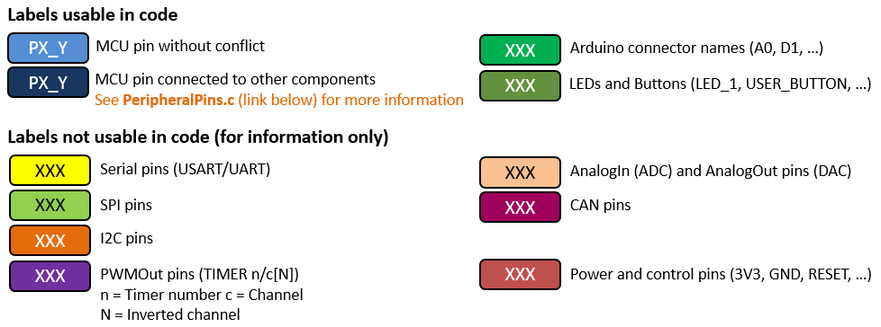
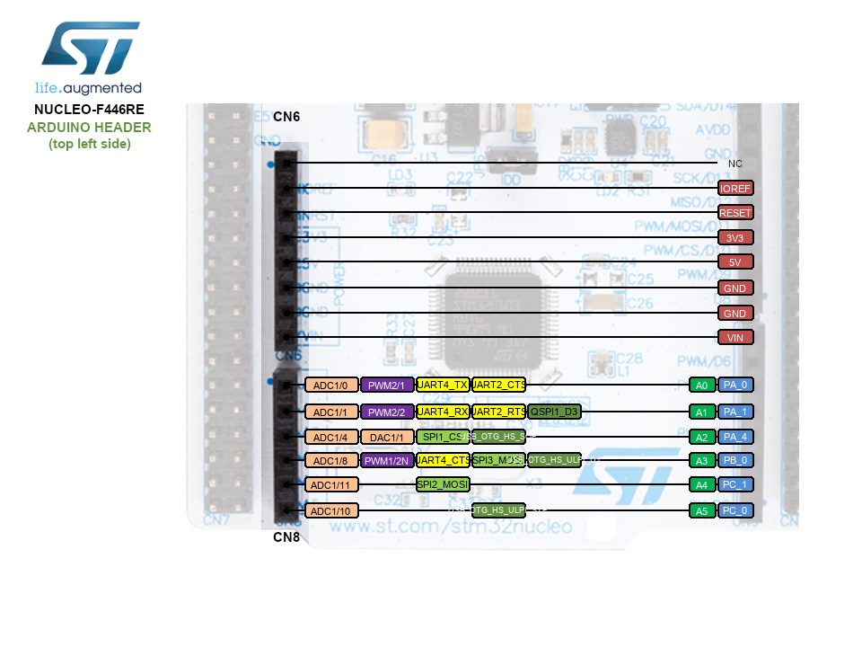
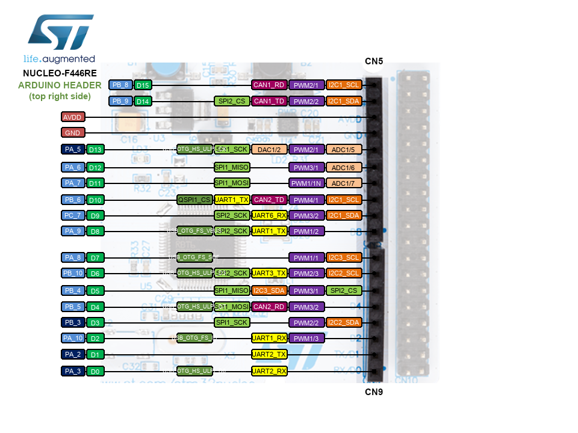
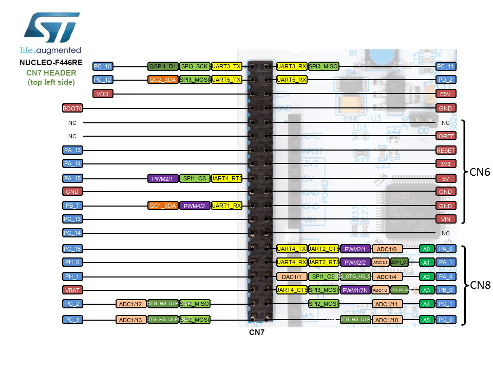
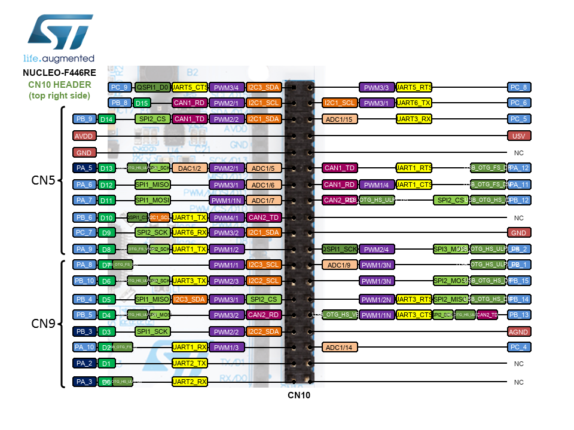

<!-- link list, last updated 15.01.2023 -->

# Nucleo F446RE Mbed Pin Map

## Pinout Legend

      
    <i>Pinout Legend</i>

## Arduino Header

      
    <i>Arduino Header left</i>

      
    <i>Arduino Header left</i>

## Morpho Header

      
    <i>Morpho Header left</i>

      
    <i>Morpho Header right</i>

